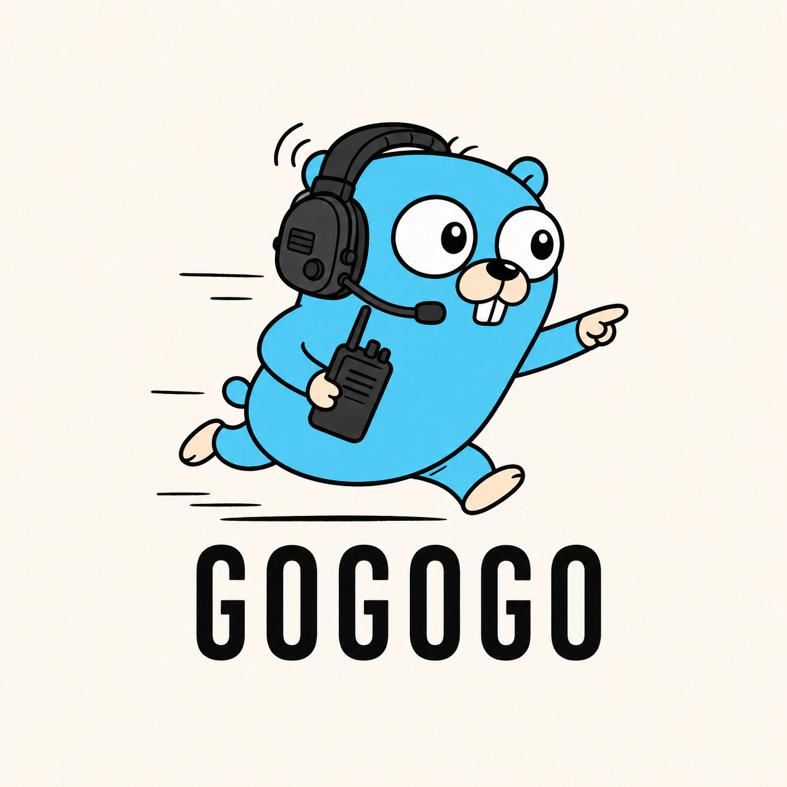

# gogogo



[![Actions Status][action-img]][action-url]
[![PkgGoDev][pkg-go-dev-img]][pkg-go-dev-url]

[action-img]: https://github.com/bcomnes/gogogo/actions/workflows/test.yml/badge.svg
[action-url]: https://github.com/bcomnes/gogogo/actions/workflows/test.yml
[pkg-go-dev-img]: https://pkg.go.dev/badge/github.com/bcomnes/gogogo/pkg
[pkg-go-dev-url]: https://pkg.go.dev/github.com/bcomnes/gogogo/pkg

`gogogo` is a command and library for creating projects from tar-based templates.
It is a Go port of [`mafintosh/create-project`](https://github.com/mafintosh/create-project).
The default template is [`bcomnes/go-template`](https://github.com/bcomnes/go-template) on its `master` branch.

## Install

Install the standalone command with [Homebrew](https://brew.sh):

```console
brew install bcomnes/tap/gogogo
```

This adds the `bcomnes/tap` tap automatically.
Update it later with `brew upgrade gogogo`.

Alternatively, install the latest source with Go:

```console
go install github.com/bcomnes/gogogo@latest
```

## Command-line usage

Create a project from the default Go template:

```console
gogogo my-project
```

Create a project from another GitHub repository and branch:

```console
gogogo my-project owner/template#main
```

A configured repository also accepts a branch name as shorthand:

```console
gogogo my-project next
```

Flags must appear before the project name, matching the standard Go `flag` package convention.
Pass template parameters with repeatable `-set key=value` flags:

```console
gogogo -set owner=bcomnes -set license=MIT my-project
```

Use a local uncompressed or gzip-compressed tar archive:

```console
gogogo -file template.tar.gz my-project
```

Download an archive from an HTTP or HTTPS URL:

```console
gogogo -url https://example.com/template.tar.gz my-project
```

By default, `gogogo` initializes a local Git repository and creates an initial commit.
Use `-no-git` to extract the project without initializing Git:

```console
gogogo -no-git my-project
```

Create and push a GitHub repository with an explicit visibility when the authenticated [GitHub CLI](https://cli.github.com) is available:

```console
gogogo -github=private my-project
gogogo -github=public -github-owner=my-org my-project
```

The owner defaults to the user authenticated by `gh`.
An explicit `-github` flag overrides any configured default, while `-no-github` creates only the local Git repository for that run.
Git and `gh` output is streamed while each command runs, and command deadlines prevent stalled authentication or pushes from hanging indefinitely.
If `gh` is missing or unauthenticated, the local repository is still created and `gogogo` prints instructions for finishing the GitHub setup later.

Run `gogogo -help` for complete help text and flag descriptions.

### Template placeholders

Text files may use both `{{key}}` and `__key__` placeholders.
The `name` parameter defaults to the destination directory's base name.
Unknown placeholders are left unchanged.
Use `__name__` in files that must remain syntactically valid before generation.
For example, a template `go.mod` can contain:

```go
module github.com/bcomnes/__name__
```

Likewise, a Go package declaration can contain `package __name__`.
Binary files are detected from their media type and complete contents, then copied byte-for-byte without placeholder substitution.

### Configuration

Inspect and update configuration non-interactively with the `config` subcommand:

```console
gogogo config show
gogogo config path
gogogo config set template bcomnes/go-template#master
gogogo config set github.visibility private
gogogo config set github.owner my-org
gogogo config set parameter.license MIT
gogogo config unset parameter.license
```

Supported keys are `template`, `github.visibility`, `github.owner`, and `parameter.<name>`.
Unset `template` to restore the built-in template, or unset GitHub settings to restore local-only creation under the authenticated GitHub user.
GitHub visibility accepts `none`, `private`, `public`, or `internal`.

The interactive configuration flow remains available:

```console
gogogo -configure
```

The existing `gogogo -default-github=private` shorthand remains available for setting visibility, while `gogogo -default-github=none` clears it.
With a configured visibility, `gogogo my-project` creates and pushes the GitHub repository automatically.
An explicit `-github` or `-github-owner` overrides configured values, and `gogogo -no-github my-project` provides a one-run local-only override.

Configuration is stored in `~/.config/gogogo.json` by default.
Set `GOGOGO_CONFIG` to use a different configuration path.

### Extraction behavior

The destination must not already exist.
Files are extracted into a private staging directory and published atomically.
The common top-level directory in the archive is removed.
Unsafe paths, escaping links, duplicate paths, and unsupported archive entries are rejected.

## Library usage

The implementation is available from `github.com/bcomnes/gogogo/pkg`.

```go
package main

import (
	"context"
	"log"
	"os"

	gogogo "github.com/bcomnes/gogogo/pkg"
)

func main() {
	archive, err := os.Open("template.tar.gz")
	if err != nil {
		log.Fatal(err)
	}
	defer archive.Close()

	project, err := gogogo.Create(
		context.Background(),
		"my-project",
		archive,
		gogogo.Options{
			Parameters: map[string]string{"owner": "bcomnes"},
		},
	)
	if err != nil {
		log.Fatal(err)
	}

	log.Printf("created %s in %s", project.Name, project.Destination)
}
```

Repository strings can be parsed with `gogogo.ParseRepository`, and `Repository.ArchiveURL` returns the corresponding GitHub archive URL.

## License

MIT
